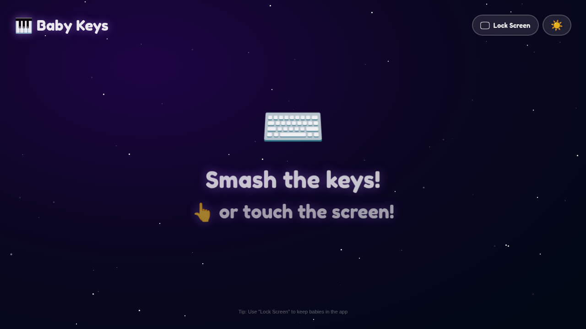
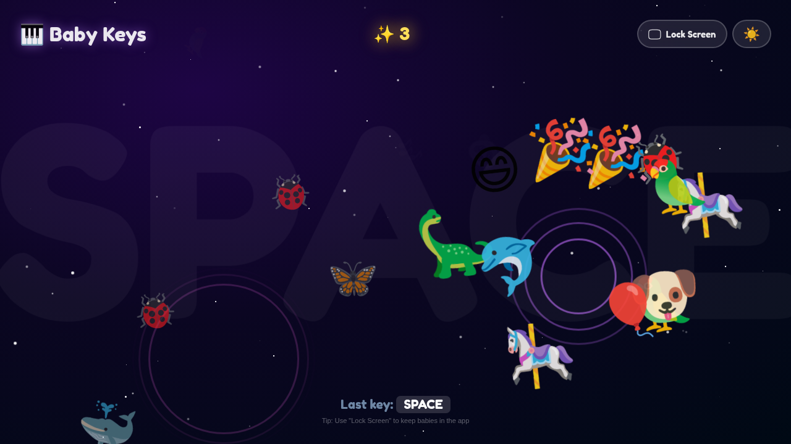
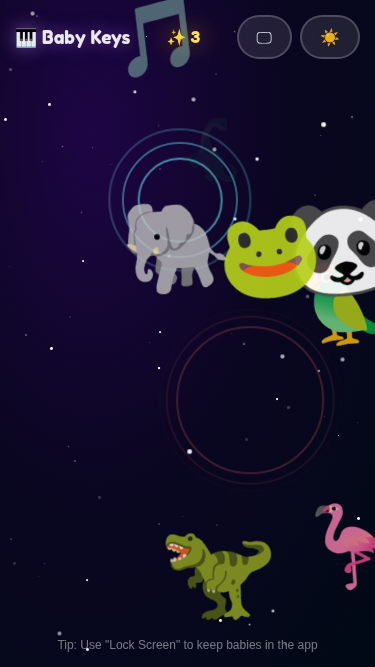
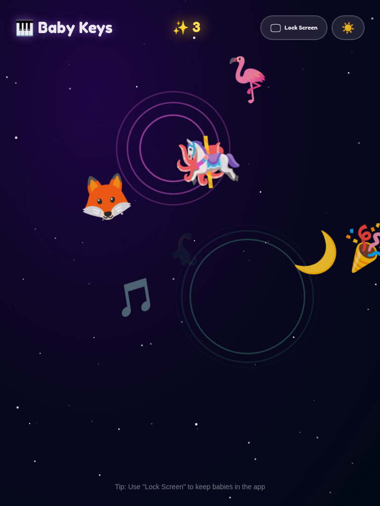

# Baby Keys

A safe, colorful interactive screen designed for babies and toddlers. Parents in tech can hand their device to their little one during work sessions and watch them discover cause and effect through key smashing and screen tapping. Every interaction rewards them with emoji animations, musical sounds, and vibrant color bursts.

## Features

- **Emoji Particle Explosions** — every keypress and screen tap spawns animated emojis that fly outward with physics-based trajectories
- **Musical Tones** — Web Audio API generates unique toy-piano notes per interaction (sine + triangle wave synthesis)
- **Dynamic Backgrounds** — dark mode with twinkling stars, light mode with floating bubbles
- **Fullscreen Lock** — keeps babies safely inside the app, preventing accidental navigation
- **Press Counter** — tracks your baby's enthusiasm with an animated counter
- **Ghost Key Display** — shows which key was pressed with a large fading label
- **Ripple Effects** — expanding colored rings at each interaction point
- **Zero Tracking** — no analytics, no cookies, no external requests, no data collection
- **Offline Ready** — works without internet after first load

## Screenshots

### Desktop

<table>
  <tr>
    <td></td>
    <td></td>
  </tr>
  <tr>
    <td align="center"><em>Dark mode — twinkling stars</em></td>
    <td align="center"><em>Emoji explosions on key smash</em></td>
  </tr>
</table>

### Mobile & Tablet

<table>
  <tr>
    <td></td>
    <td></td>
  </tr>
  <tr>
    <td align="center"><em>iPhone SE (375x667)</em></td>
    <td align="center"><em>iPad (768x1024)</em></td>
  </tr>
</table>

## Tech Stack

- **React 19** with TypeScript for type-safe component architecture
- **Vite** for fast development and optimized production builds
- **CSS Modules** for scoped, zero-runtime styling
- **Web Audio API** for real-time sound synthesis (no audio files)
- **Cloudflare Workers** for global edge deployment

## Getting Started

### Prerequisites

- Node.js 20+
- npm 10+

### Development

```bash
git clone https://github.com/be11amer/baby-key.git
cd baby-key
npm install
npm run dev
```

### Build

```bash
npm run build
npm run preview
```

### Lint & Format

```bash
npm run lint
npm run format
```

## Project Structure

```
src/
├── components/
│   ├── background/       Stars (dark) and Bubbles (light) ambient effects
│   ├── effects/          Particle, Ripple, FlashLabel — interaction feedback
│   ├── ui/               TopBar, CenterHint, BottomInfo, IconButton
│   └── BabyKeysApp.tsx   Root composition component
├── hooks/
│   ├── useAudio.ts       Web Audio API context and note synthesis
│   ├── useFullscreen.ts  Fullscreen API toggle and state
│   └── useInteraction.ts Core orchestrator — events, particles, ripples
├── data/
│   ├── animations.ts     43 emoji configurations
│   └── constants.ts      Audio frequencies, color palettes, limits
├── types/
│   └── index.ts          Shared TypeScript interfaces
└── styles/
    └── global.css        CSS reset and font import
```

### Architecture

The app follows a hooks-driven architecture with clear separation of concerns:

- **Data layer** (`data/`) — pure constants, no logic
- **Hooks** (`hooks/`) — all stateful logic encapsulated in custom hooks. `useInteraction` orchestrates the core loop: event capture → audio feedback → particle/ripple spawning → state updates
- **Components** (`components/`) — purely presentational, receive data via props. `React.memo` on all leaf components prevents unnecessary re-renders
- **Styles** — CSS Modules per component for scoped class names, CSS animations for GPU-accelerated transforms

### Baby Safety

- All keyboard events intercepted with `preventDefault` to block navigation shortcuts
- Touch events captured to prevent scrolling, zooming, and pull-to-refresh
- Fullscreen mode hides browser chrome
- No clickable links or navigable elements in the play area
- `user-select: none` and `touch-action: none` prevent text selection and gestures

## Deployment

### Cloudflare Workers

The app is deployed via Cloudflare Workers with static asset hosting. SPA routing is handled natively by `wrangler.jsonc` (`not_found_handling: "single-page-application"`), which serves `index.html` for any route that doesn't match a static file.

Security headers (CSP, X-Frame-Options, etc.) are configured via `public/_headers`.

```bash
npm run deploy
```

Or manually:

```bash
npm run build
npx wrangler deploy
```

## Security

- **Content Security Policy** — restricts scripts, styles, fonts, and connections to same-origin only
- **Self-hosted font** — Fredoka One bundled via `@fontsource`, zero external CDN requests
- **No data persistence** — no localStorage, cookies, or session storage
- **No external API calls** — everything runs client-side in the browser
- **X-Frame-Options: DENY** — prevents embedding in iframes
- **Permissions-Policy** — disables camera, microphone, geolocation, and payment APIs

## License

MIT
